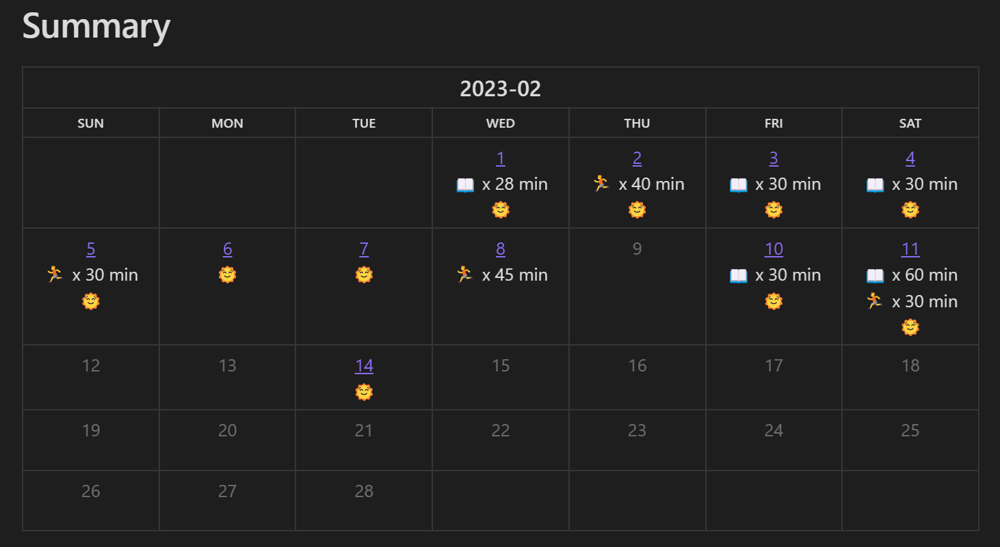

## Obsidian Habit Calendar Plugin

Monthly Habit Calendar for DataviewJS. 

此插件用于将习惯在一个月历中展示，基于[Habit Track](https://github.com/duoani/obsidian-habit-tracker)，需要搭配[DataviewJS](https://blacksmithgu.github.io/obsidian-dataview/)使用。

此插件对外暴露一个`renderHabitCalendar`接口，只需要准备好数据然后在DataviewJS块中调用该接口即可。

插件接收两种类型的数据：
1. Dataview表格
2. 自定义数据

## change log

1.0.x -> 1.1.x

changed the `renderHabitCalendar` interface, from

```typescript
renderHabitCalendar(this.container, {
  year: number
  month: number
  width: string
  filepath: string
  format: string
  entries: Entry[]
})
```

to

```typescript
renderHabitCalendar(this.container, dv, {
  year: number  // required
  month: number // required
  data: any // required
  width: string
  format: string
  note_pattern: string
})
```


## 输入dataview 表格

对于[Dataview表格](https://blacksmithgu.github.io/obsidian-dataview/queries/query-types/#table)，每一列会被当成一个习惯。

~~~
```dataview
table coding as "Coding|👨‍💻", swim as "Swimming|🏊"
from "diarys"
```
~~~

上面的[DQL](https://blacksmithgu.github.io/obsidian-dataview/queries/structure/)查询出来长这样：


把上面的查询语句传入到`dv.query()`中，获取查询结果后传入`renderHabitCalendar`即可。

~~~
```dataviewjs
const table = await dv.query(`
table coding as "Coding|👨‍💻", swim as "Swimming|🏊"
from "diarys"
`)
renderHabitCalendar(this.container, dv, {
	year: 2023,
	month: 2,
	data: table
})
```
~~~

然后你就得到了这样一个月历：


注意到每一列的header，如果包含`|`字符的话，最后一个`|`后的子串会被当成label显示在月历中。

### 自定义日记名

如果使用了像`YYYY年MM月DD日`这样的自定义日记名的话，可以使用`date_pattern`指明：

~~~
```dataviewjs
const table = await dv.query(`
table coding as "Coding|👨‍💻", swim as "Swimming|🏊"
from "日记"
`)
console.log(table)
renderHabitCalendar(this.container, dv, {
	year: 2023,
	month: 2,
	data: table,
  date_pattern: 'YYYY年MM月DD日'
})
```
~~~

## 输入自定义数据

如果想更灵活地输入习惯数据的话，可以手动构建Entry列表传递到插件当中，目前月历中的内容支持纯文本、HTML以及Markdown。

### 基本操作

~~~
```dataviewjs
renderHabitCalendar(this.container, dv, {
  year: 2023,
  month: 1,
  data: [{
    date: '2023-01-01',
    content: '⭐'
  }, {
    date: '2023-01-03',
    content: '⭐'
  }]
})
```
~~~

上面的代码渲染出来长这样：


如果日记命名方式是`YYYY-MM-DD`，月历中的每一天会自动关联到对应日记，如果是自定义的命名方式，同样可以使用`date_pattern`指明。


### 用HTML填充月历

Want to fill the calendar with HTML? Here we go:

~~~
```dataviewjs
renderHabitCalendar(this.container, dv, {
  year: 2023,
  month: 1,
  format: 'html',   // set the format to html
  data: [{
    date: '2023-01-01',
    content: '<a href="https://www.google.com">Google</a>'
  }, {
    date: '2023-01-03',
    content: '⭐',
  }]
})
```
~~~


**注意**：要使用HTML填充需要在本插件的设置中开启HTML。

### 用Markdown填充月历

不想写html就写markdown吧。

~~~
```dataviewjs
renderHabitCalendar(this.container, dv, {
  year: 2023,
  month: 1,
  format: 'markdown',   // don't forget to change the format~
  data: [{
    date: '2023-01-01',
    content: '[Google](https://www.google.com)'
  }, {
    date: '2023-01-03',
    content: '⭐',
  }]
})
```
~~~


有时候渲染markdown会出毛病，可以关闭文件再打开试试。

### 自定义链接

默认情况下，如果能关联上的话，月历中的每天会被关联到对应的日记，但是如果你想手动关联的话也是可以做到的。

例如如果想要每个月的第一天关联到一个`Monthly Target.md`文件，可以通过设置`link`属性做到：

~~~
```dataviewjs
renderHabitCalendar(this.container, dv, {
  year: 2023,
  month: 1,
  data: [{
    date: '2023-01-01',
    content: '⭐',
    link: 'Monthly Target'  // like this line
  }, {
    date: '2023-01-03',
    content: '⭐',
  }]
})
```
~~~

## 详细使用方法

插件的接口目前长这样：

```
renderHabitCalendar = (el: HTMLElement, dv: any, calendarParam: CalendarParam)
```

第一个参数是html容器，直接填`this.container`即可。

第二个参数是Dataview对象，用于获取路径和文件信息，传入`dv`即可，前两个参数是固定的。

第三个参数包含如下字段：

- `year`: 显然，月历表示的年
- `month`: 月历表示的月
- `data`: 数据列表，每一个元素是一个Entry，一个Entry包含下面字段
    - `date`: 日期
    - `content`: 在对应日期中显示的内容
    - `link`: 对应日期自定义链接，想链接到哪输入Obsidian中`[[]]`内部文字即可. 例如要链接到`[[2023-01-01]]`，输入`2023-01-01`
- `format`: `data[i].content`的内容可以作为纯文本、html和markdown被渲染，这个字段指明使用哪种格式，可接受`html`或者`markdown`作为输入，其他输入或者不输入，则作为文本展示。

## 我是怎样记录习惯的

可以看看仓库里的[example vault](https://github.com/hedonihilist/obsidian-habit-calendar/tree/master/ExampleVault). 习惯月历会被展示成这样：


### 添加习惯模板

在日记模板中，添加习惯相关的模板：

~~~
```
## habits

- [ ] #habit read for (reading:: 30) minutes
- [ ] #habit jog for (jogging:: 30) minutes
- [ ] #habit get up before 8:00 am (wakey:: true)
```
~~~

我习惯使用`#habit`这个标签来过滤习惯，加上标签之后也方便和其他的checkbox区分。

### 记录习惯

当天完成了习惯之后，在对应的日记中勾选已完成的习惯，并填写习惯完成的强度：


### 展示习惯

使用DataviewJS查询所有的习惯，并且传入到插件中：

~~~
```
let files = dv.pages(`"diarys"`)
const habit = 'reading'
const year = 2023
const month = 2
const habit_str = '📖 {habit} min'  // {habit} will be replaced with the value of corresponding habit.

let data = []
for (let file of files) {
	console.log(file)
	for (let task of file.file.tasks) {
		if (task.tags.contains('#habit') && task.checked && task[habit]) { // select only checked habits
			data.push({date: file.file.name, content: habit_str.replace('{habit}', task[habit])})
		}
	} 
}
console.log(data)
renderHabitCalendar(this.container, dv, {year, month, data}) 
```
~~~


### 在一个月历中查看所有的习惯

~~~
```dataviewjs
let pages = dv.pages(`"diarys"`)
const year = 2023
const month = 2
const date_pattern = 'YYYY-MM-DD'
const habit_tag = '#habit'
const habits = {
	'reading': '📖 x {habit} min',  // this habit will be displayed like '📖 x 30 min'
	'jogging': '🏃 x {habit} min',
	'wakey': '🌞',
}

let data = {}
for (let page of pages) {
	let date = page.file.name
	data[date] = data[date] || ''
	for (let task of page.file.tasks.filter(task => task.tags.contains(habit_tag) && task.checked)) {
		for (let habit in habits) {
			if (task[habit]) {
				data[date] += habits[habit].replace('{habit}', task[habit]) + '\n'
			}
		}
	} 
}

let calendarData = []
for (let date in data) {
	calendarData.push({date: date, content: data[date]})
}
renderHabitCalendar(this.container, dv, {year, month, data: calendarData, date_pattern}) 
```
~~~

长这样：

