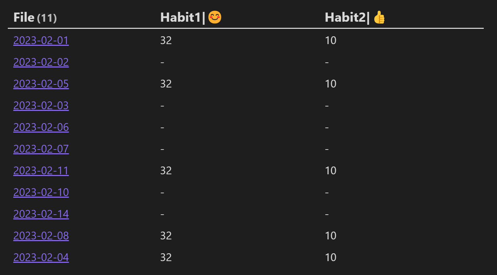
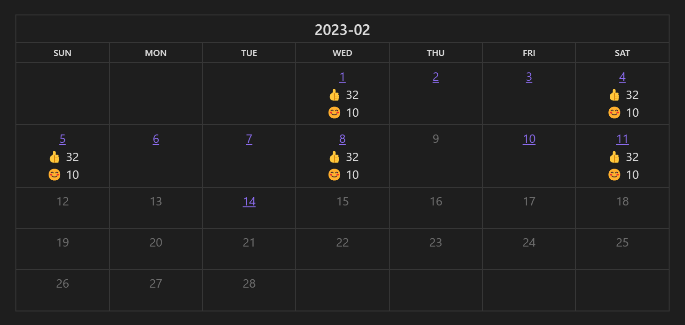
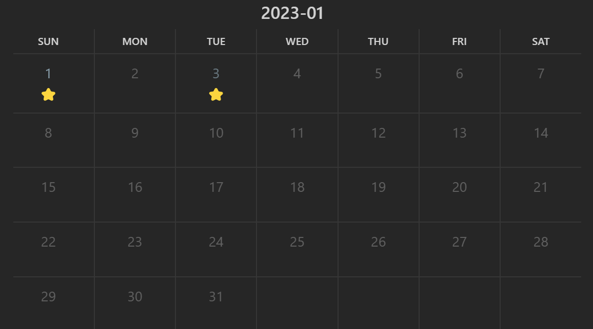
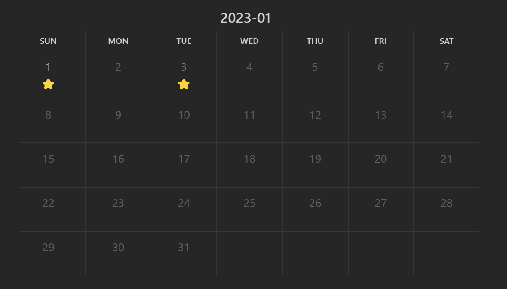
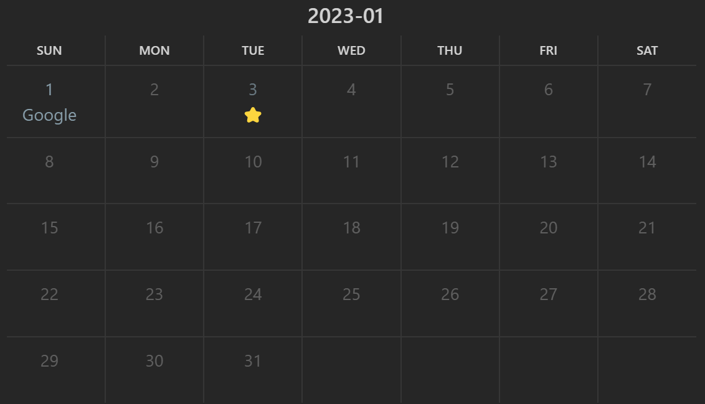
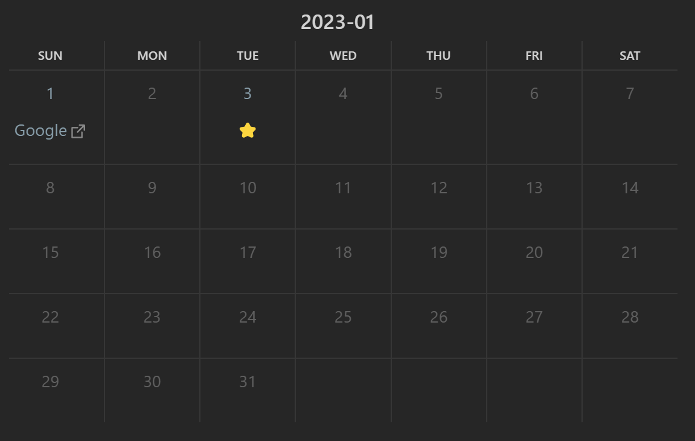
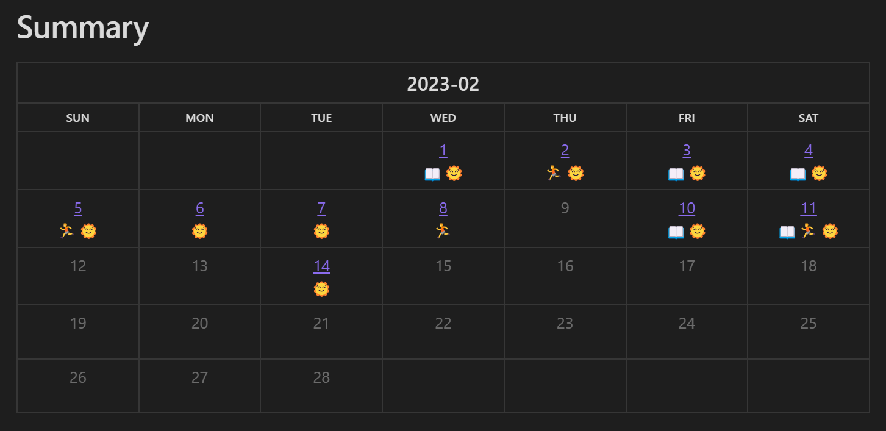
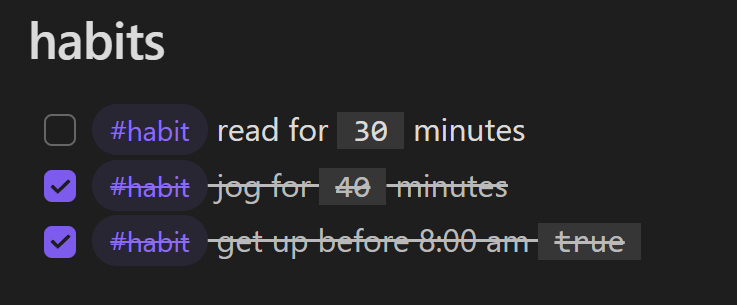
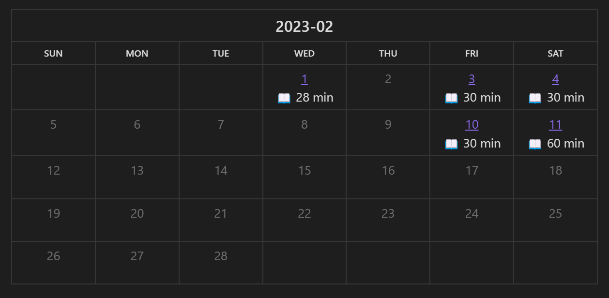

## Obsidian Habit Calendar Plugin

Monthly Habit Calendar for DataviewJS. 

This plugin helps you render a calendar inside DataviewJS code block, showing your habit status within a month. It's based on the [Habit Track](https://github.com/duoani/obsidian-habit-tracker) plugin by [@duoani](https://github.com/duoani).

This plugin is intended to be used alongside [DataviewJS](https://blacksmithgu.github.io/obsidian-dataview/). All you need to do is prepare the data and call `renderHabitCalendar` in a dataviewjs code block.

There are two ways to populate the calendar:

1. Dataview Table
2. manually collected data

## change log

1.0.x -> 1.1.x

changed the `renderHabitCalendar` interface, from

```typescript
renderHabitCalendar(this.container, {
  year: number
  month: number
  width: string
  filepath: string
  format: string
  entries: Entry[]
})
```

to

```typescript
renderHabitCalendar(this.container, dv, {
  year: number  // required
  month: number // required
  data: any // required
  width: string
  format: string
  note_pattern: string
})
```


## Calendar from Dataview Table

For it to work, prepare a [Dataview Table](https://blacksmithgu.github.io/obsidian-dataview/queries/query-types/#table) with the first column as the file link and other columns as habits.

~~~
```dataview
table habit1 as "Habit1|😊", habit2 as "Habit2|👍"
from "diarys"
```
~~~

For example, with the above [DQL](https://blacksmithgu.github.io/obsidian-dataview/queries/structure/) you will get a table like this:



To render the table as a calendar, pass the result of DQL to `renderHabitCalendar` in a dataviewjs block:

~~~
```dataviewjs
const table = await dv.query(`
table
habit1 as "Habit1|😊", habit2 as "Habit2|👍" 
from "diarys"`)
console.log(table)
renderHabitCalendar(this.container, dv, {
	year: 2023,
	month: 2,
	data: table
})
```
~~~

The calendar should look like this:



Notice that you can customize the habit label 😊 in the calendar by setting the header to "aaabbbccc|label". the text after the last "|" will be used as the label.

### not using YYYY-MM-DD ?

If you are not using the 'YYYY-MM-DD' naming pattern with your daily note, you can set the pattern while calling `renderHabitCalendar`, so that this plugin can associate the habits with correct daily note:

~~~
```dataviewjs
const table = await dv.query(`
table
habit1 as "H1|👍", habit2 as "H2|😊" 
from "日记"`)
console.log(table)
renderHabitCalendar(this.container, dv, {
	year: 2023,
	month: 2,
	data: table,
  note_pattern: 'YYYY年MM月DD日',
})
```
~~~

## Calendar from manually collected data

This plugin also accepts customized data, jump to the bottom for detailed usage.

### Basic Usage

~~~
```dataviewjs
renderHabitCalendar(this.container, dv, {
  year: 2023,
  month: 1,
  data: [{
    date: '2023-01-01',
    content: '⭐'
  }, {
    date: '2023-01-03',
    content: '⭐'
  }]
})
```
~~~

The above code will be rendered like this:



If your daily note is of `YYYY-MM-DD` format, the calendar will be associated with your daily note automatically. You can hover over the number or click the number to access the corresponding note.



### Customize link

In case you have a different daily note format or want to customize linking, just pass in the link of each entry.

Say your daily notes are named like `2023年01月01日.md`, all you need to do is add the `link` field and set to `2023年01年01日`:

~~~
```
renderHabitCalendar(this.container, dv, {
  year: 2023,
  month: 1,
  data: [{
    date: '2023-01-01',
    content: '⭐',
    link: '2023年01月01日'  // like this line
  }, {
    date: '2023-01-03',
    content: '⭐',
    link: '2023年01月03日'
  }]
})
```
~~~


### Fill Calendar with HTML

Want to fill the calendar with HTML? Here we go:

~~~
```dataviewjs
renderHabitCalendar(this.container, dv, {
  year: 2023,
  month: 1,
  format: 'html',   // set the format to html
  data: [{
    date: '2023-01-01',
    content: '<a href="https://www.google.com">Google</a>'
  }, {
    date: '2023-01-03',
    content: '⭐',
  }]
})
```
~~~



**Note:** don't forget to enable the HTML in the plugin settings.

### Fill Calendar with Markdown

If you don't want to write html, write markdown then. 

~~~
```dataviewjs
renderHabitCalendar(this.container, dv, {
  year: 2023,
  month: 1,
  format: 'markdown',   // don't forget to change the format~
  data: [{
    date: '2023-01-01',
    content: '[Google](https://www.google.com)'
  }, {
    date: '2023-01-03',
    content: '⭐',
  }],
  filepath: dv.current().file.path  // also add this line
})
```
~~~



**Note1:** Sometimes the markdown text is not rendered correctly. Try switching to other files and switching back.

**Note2:** the `filepath` is the path of the file where dataviewjs code lies. If the markdown text contains some relative link, you should input this field.

### Detailed Usage

The first argument should be the html container in which the calendar will be created. Most of the time, `this.container` will do.

The second argument should be the Dataview object `dv`, which will be used to get information of the notes.

You can pass the habit data through the third argument. The following fields are supported:

- `year`: year of the calendar, apparently
- `month`: month of the calendar
- `data`: this filed can be a Dataview Table or a list of entries containing the habit data per day. A entry contains
    - `date`: date of the habit
    - `content`: whatever you want to put in the calendar
    - `link`: the file you want the entry to link to, just pass in the text inside `[[]]`. For example, if the original obsidian link is `[[2023-01-01]]`, pass in `2023-01-01`.
- `format`: the way you want `data[i].content` to be rendered. Choose `html` or `markdown` to render as html or markdown, make sure their cooresopnding settings are enabled in the settings tab. Leave empty to treat the content as plain text.

## How I record my habits


Check out the [example vault](https://github.com/hedonihilist/obsidian-habit-calendar/tree/master/ExampleVault). Your habits can look like this



### Add habit templates

In your diary template, add some habits you'd like to track:

~~~
```
## habits

- [ ] #habit read for (reading:: 30) minutes
- [ ] #habit jog for (jogging:: 30) minutes
- [ ] #habit get up before 8:00 am (wakey:: true)
```
~~~

Here we use `#habit` tag to distinguish habits from normal tasks and use Dataview attributes to record the intensity of the habit.

### Record habit

Once you completed a habit, check the corresponding habit in your diary.



### View your habits

Use dataviewjs to query the accomplished habits and pass the data to `renderHabitCalendar`. The following code will query the days you did some reading.

~~~
```
let files = dv.pages(`"diarys"`)
let data = []
for (let file of files) {
	console.log(file)
	for (let task of file.file.tasks) {
		if (task.tags.contains('#habit') && task.checked && task.reading) { // select only checked habits
			data.push({date: file.file.name, content: `📖 ${task.reading} min`})
		}
	} 
}
renderHabitCalendar(this.container, dv, {year: 2023, month: 2, data: data}) 
```
~~~



## Plans

- [x] jump right to the diary on click
- [x] preview diary on hovering
- [x] support render markdown in calendar